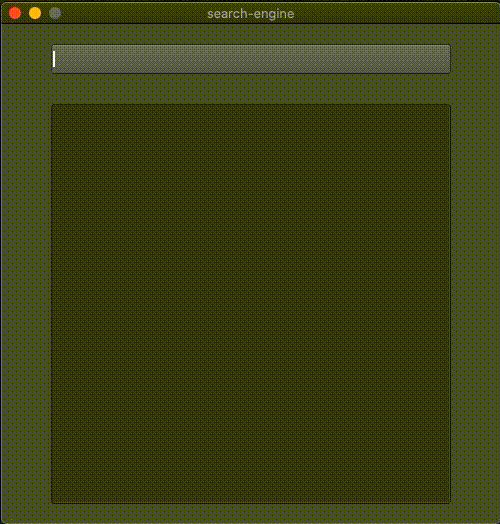

# prefix-search-engine

This project contains a BinaryTree struct that represents the prefix binary tree data structure used for efficient string searching. The BinaryTree struct is responsible for organizing and managing the dataset of strings, enabling quick prefix-based searches.

<div align="left">
  
</div>
For testing purposes, we've included a sample file named "top-1m.txt" that contains the top 1 million web URLs. This allows you to demonstrate the speed and efficiency of this search engine when performing prefix searches on a large dataset.

Please note that in a real-world scenario, you would typically obtain such data from a web source or another relevant data provider..

### Features
- Fast and efficient string searching using a prefix binary tree.
- Supports searching in text files with one string per line.
- Simple and easy-to-use interface.

### Binary-Search-Tree
The binary tree implemented in this project uses lexicographical order (lexikographische Ordnung) for organizing and searching strings. This means that strings are arranged in the tree according to their lexicographical (dictionary) order, where "smaller" strings come before "larger" strings based on their character sequences.

#### Example Tree
<p float="left">
   
</p>
For simplicity, we translate this binary tree with strings into one with integers, ensuring that the trees are isomorphic.

#### Translated Tree
<p float="left">
   
</p>

##### How the lookup and lookup_recursive method works
First create the translated tree, for simplicity we work here with integers, not with strings..
```js
let mut tree = SearchTree::new();
tree.push(4);
tree.push(2);
tree.push(6);
tree.push(1);
tree.push(3);
tree.push(5);
tree.push(7);
```
Call the lookup method:
```js
tree.lookup(2, 5));
```
The result of lookup(2,5) would look visual like that:
<p float="left">
   
</p>

### Dependencies
This project uses the FLTK library for creating the user interface. You can add it to your Cargo.toml file:

#### Install FLTK-libary
Run the following Cargo command in your project directory:
```js
Cargo add fltk
Cargo add fltk-theme
```
#### About FLTK
```js
https://crates.io/crates/fltk
```
### Usage
1. Clone the Repository to your local machine:
```js
git clone https://github.com/raphsenn/prefix-search-engine.git
cd prefix-search-engine
```
2. Check if your Cargo.toml has the fltk flag under [dependencies]:
```js
[dependencies]
fltk = "1.4.13"
fltk-theme = "0.7.1"

[[bin]]
name = "searchengine"
path = "searchengine.rs"
```
3. You can specify the input dataset file by modifying top-1m.csv file, to a file of your own:
```js
search_engine.read("top-1m.csv")?;
```

4. Compile and run the project using Cargo:
```js
cargo run
```

### License
This project is licensed under the MIT License. See the LICENSE file for details.
